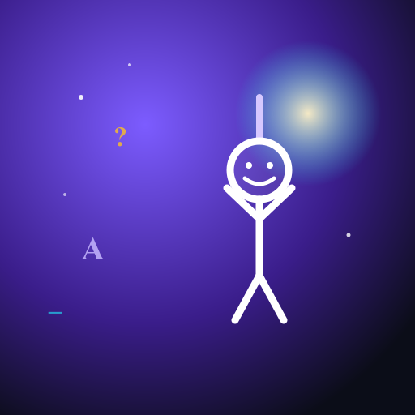

# Hangman

A modern, animated Hangman game built with React and Vite. Four game modes,
six categories, four difficulty levels, synth sound effects, confetti
celebrations, persistent stats, and a packaged Android build via Capacitor.



## Features

- **Four game modes**
  - **Campaign** — climb 10+ levels of escalating difficulty, with three lives that carry over
  - **Classic** — pick a category and difficulty for a single, focused puzzle
  - **Time Attack** — race the clock; bonus score for finishing with seconds to spare
  - **Categories** — stay in one theme while difficulty ramps every two levels
- **Six word categories** — animals, countries, movies, science, food, sports
- **Four difficulty levels** — easy (8 chances) to expert (4 chances); the figure draws faster the harder you go
- **Animated stick figure** — swings while alive, slumps when you lose, breaks free of the rope and **dances** when you win
- **Confetti** — small burst on every correct letter, full celebration rain on each round win
- **Synth sound effects** — entirely WebAudio, no audio files; mute toggle in-game
- **Hint system** — spend a hint token to reveal a clue (-25 score)
- **Persistent stats** — best score, highest level, win rate, and longest streak saved to localStorage
- **Polished UI** — animated cosmic gradient background, glassmorphism panels, neon keyboard, swinging title letters, drifting ghost words on the menu hero
- **Mobile-friendly** — 48px+ touch targets, safe-area padding, viewport-fit cover, `prefers-reduced-motion` support, Android back-button handling

## Tech stack

- [React](https://react.dev) 19 + [Vite](https://vitejs.dev)
- Pure CSS (no Tailwind / no UI library) — all styling lives in `src/App.css`
- [Capacitor](https://capacitorjs.com) for the Android wrapper
- [sharp](https://sharp.pixelplumbing.com) for build-time icon and feature-graphic generation
- No runtime dependencies beyond React itself

## Getting started

```bash
# install
npm install

# run the dev server
npm run dev
# → http://localhost:5173

# production build
npm run build
```

## Project structure

```
src/
├── App.jsx                    routes between menu and game
├── App.css                    full theme + all animations
├── data/words.js              word bank: 6 categories × 4 difficulties
├── hooks/
│   ├── useGame.js             reducer-based state machine
│   ├── useSound.js            WebAudio synth blips
│   ├── useStats.js            localStorage best-score tracking
│   └── useBackButton.js       Capacitor Android back-button glue
└── components/
    ├── MainMenu.jsx           mode + category + difficulty selection
    ├── MenuHero.jsx           animated SVG hero scene with dangling letters
    ├── GameScreen.jsx         board layout + confetti + game-over modal trigger
    ├── HangmanDrawing.jsx     progressive SVG drawing, swing/dance/slump states
    ├── WordDisplay.jsx        underscores + letter-flip reveal
    ├── Keyboard.jsx           on-screen keyboard with key-pop feedback
    ├── HUD.jsx                score, lives, timer, hint, mute
    ├── Confetti.jsx           canvas confetti (small bursts + full rain)
    └── GameOverModal.jsx      win / lose / level-complete dialog
```

## Building for Android

The project ships with a Capacitor configuration so you can produce an
installable Android app or upload to the Play Store.

```bash
# generates the launcher icons + Play Store assets
npm run assets

# builds the web app and copies it into the Android project
npm run android:sync

# builds, syncs, then opens Android Studio for signing & .aab generation
npm run android:open
```

In Android Studio: **Build → Generate Signed Bundle / APK → Android App
Bundle**. Create a keystore once, **back it up**, then upload the resulting
`app-release.aab` to Play Console.

Play Store assets and a publishing checklist are generated under
[`store-assets/`](./store-assets/), including a draft privacy policy and the
listing copy.

## Controls

- **Mouse / touch** — click letters on the on-screen keyboard
- **Physical keyboard** — `A`–`Z` to guess
- **Android back button** — return to menu (in-game) or exit (on menu)

## Scoring

- +50–350 per word solved (scaled by difficulty)
- +5 × seconds remaining (Time Attack only)
- +15 × lives remaining
- +10 × current streak
- –25 if you reveal the hint

## Roadmap ideas

- Daily challenge with a shared seed
- Online leaderboard
- Custom word packs / theme drops
- Localization (the word lists are flat JS objects — easy to translate)
- Share-card image of your win streak

## License

MIT — do whatever you want with it. If you ship a fork to the Play Store, a
star is appreciated but not required.

## Acknowledgements

Built as a learning exercise in animated SVG, WebAudio, Capacitor, and the
end-to-end Play Store publishing pipeline. The hanging-figure metaphor is
softened on the launcher icon (happy figure with raised arms, no rope) so
the listing reads more "word puzzle" than "execution" — a deliberate choice
for content-rating reasons.
